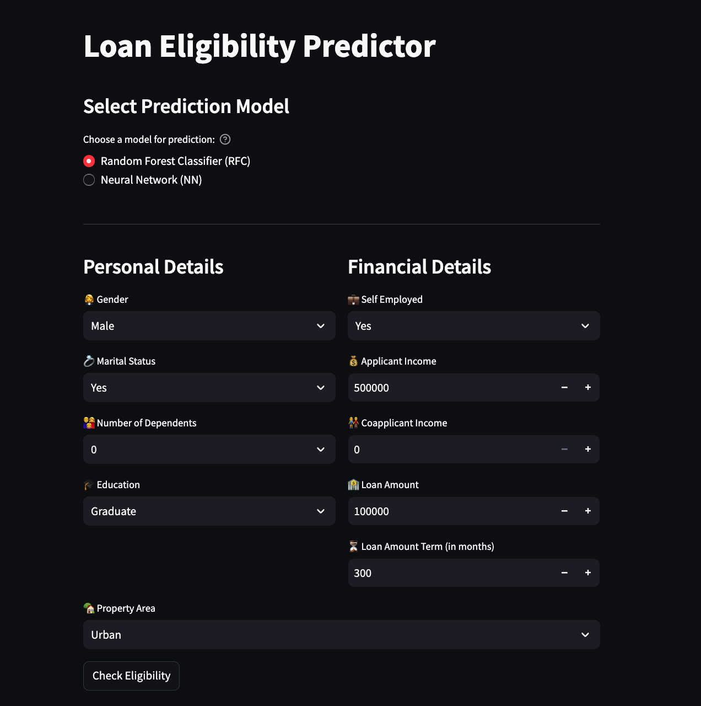
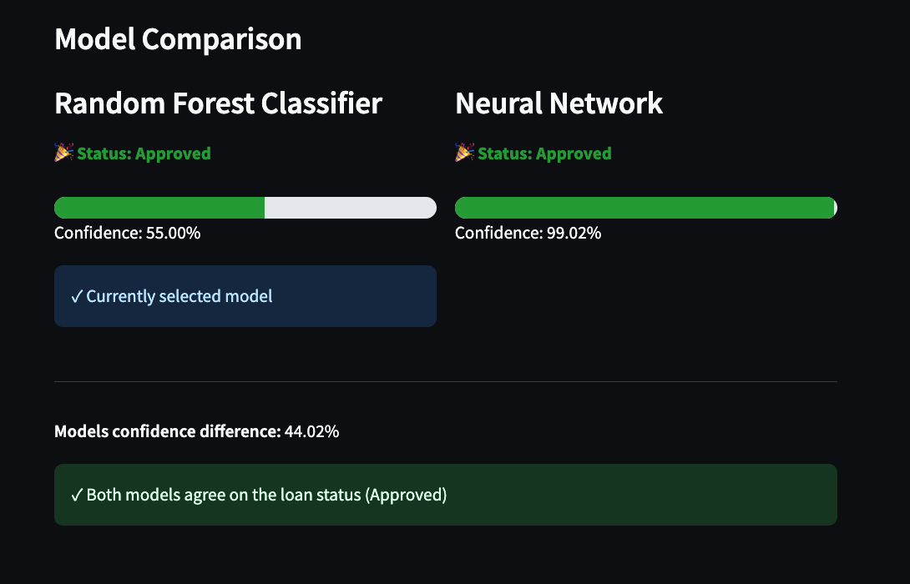

# Loan Eligibility Predictor

  

An application for prediction loan eligibility for applicants based on their personal, financial, and property-related information.




---

## Table of Contents

- [Overview](#overview)
- [Features](#features)
- [Installation](#installation)
  - [Using pip](#using-pip)
  - [Using Conda](#using-conda)
- [Usage](#usage)
- [License](#license)

---

## Overview

The **Loan Eligibility Predictor** is a tool built to assist banks and financial institutions in determining whether an applicant qualifies for a loan. Trained on a Random Forest Classifier, which is then deployed as a web application using Streamlit. The app allows users to input their details and receive instant feedback on their loan eligibility, along with a confidence score indicating the model's certainty.

---

## Features

- Predicts loan eligibility in real-time.
- Provides a confidence score for each prediction.
- User-friendly interface powered by Streamlit.
- Support for both neural network and random forest classifier models.

---

## Project Structure 

```bash
LoanEligibilityPredictor/
├── assets/                 # Contains images and other assets
├── dataset/                # Contains the dataset files
├── app.py                  # Streamlit web application
├── eda.ipynb               # Exploratory Data Analysis notebook
├── LoanerNN.ipynb          # Neural Network model notebook
├── LoanerRFC.ipynb         # Random Forest Classifier notebook
├── nn.py                   # Neural Network model script
├── utils.py                # Utility functions
├── requirements.txt        # Python dependencies
├── environment.yml         # Conda environment configuration
├── README.md               # Project documentation
└── LICENSE                 # License information
```

## Installation

You can install and run this application using either pip or conda.

### Using pip

1. **Clone the Repository**:
   ```bash
   git clone https://github.com/SamarthPyati/LoanEligibilityPredictor.git
   cd loan-eligibility-predictor
   ```

2. **Set Up a Virtual Environment** (Optional but Recommended):
   ```bash
   python3 -m venv venv
   source venv/bin/activate  # On Windows: venv\Scripts\activate
   ```

3. **Install Dependencies**:
   ```bash
   pip install -r requirements.txt
   ```

### Using Conda

1. **Clone the Repository**:
   ```bash
   git clone https://github.com/SamarthPyati/LoanEligibilityPredictor.git
   cd loan-eligibility-predictor
   ```

3. **Create and Activate a New Conda Environment**:
   ```bash
   conda env create -f environment.yml
   conda activate loan-predictor
   ```

4. **Alternative: Manual Conda Setup** (if environment.yml is not working):
   ```bash
   conda create -n loan-predictor 
   conda activate loan-predictor
   pip install -r requirements.txt
   ```

---

## Usage

1. **Run the Streamlit App**:
   ```bash
   streamlit run app.py
   ```

2. **Enter Applicant Information**:
   Fill in the required fields with the applicant's details.

3. **Get Prediction**:
   Click the "Predict" button to receive the loan eligibility prediction.

---

### Training the Model

---
```bash
# Run the training notebook
jupyter notebook LoanerRFC.ipynb
```


Alternatively, for the Neural Network model:

```bash
# Run the training notebook
jupyter notebook LoanerNN.ipynb
```


These notebooks will guide you through the training process, including data preprocessing, model training, and evaluation.

### Testing the Model

Testing is integrated within the training notebooks. After training, the notebooks include evaluation metrics such as accuracy, precision, recall, and ROC-AUC scores to assess model performance.

### Running the Web Application

To launch the Streamlit web application for real-time loan eligibility predictions:


```bash
streamlit run app.py
```

This will open a web interface where you can input applicant details and receive eligibility predictions.

## File Descriptions

- **`app.py`**: Main Streamlit application script that provides a web interface for users to input data and receive predictions.
- **`eda.ipynb`**: Notebook for Exploratory Data Analysis, including data visualization and initial insights.
- **`LoanerRFC.ipynb`**: Notebook detailing the training process using the Random Forest Classifier.
- **`LoanerNN.ipynb`**: Notebook detailing the training process using a Neural Network model.
- **`nn.py`**: Python script containing the implementation of the Neural Network model.
- **`utils.py`**: Contains utility functions used across the project, such as data preprocessing functions.
- **`requirements.txt`**: Lists all Python dependencies required to run the project.
- **`environment.yml`**: Conda environment configuration file listing dependencies and environment settings.
- **`assets/`**: Directory containing images and other assets used in the project.
- **`dataset/`**: Directory containing the dataset files used for training and testing.

## License

This project is licensed under the MIT License. See the [LICENSE](LICENSE) file for details.
